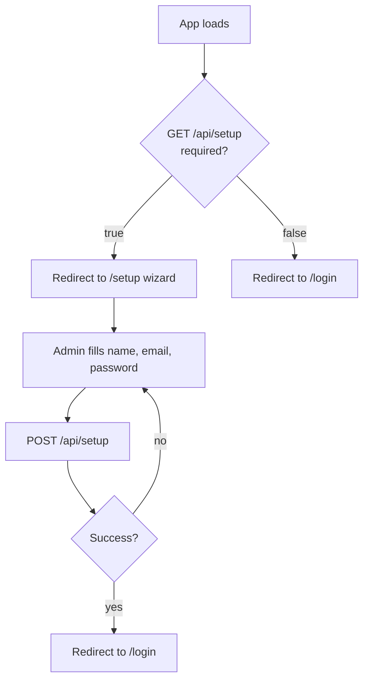
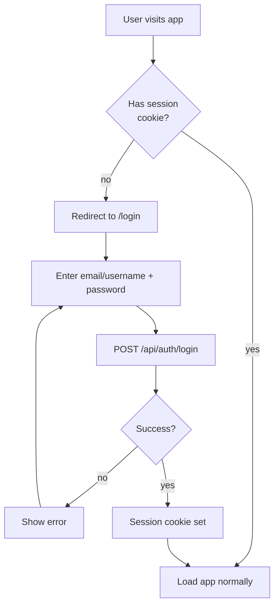
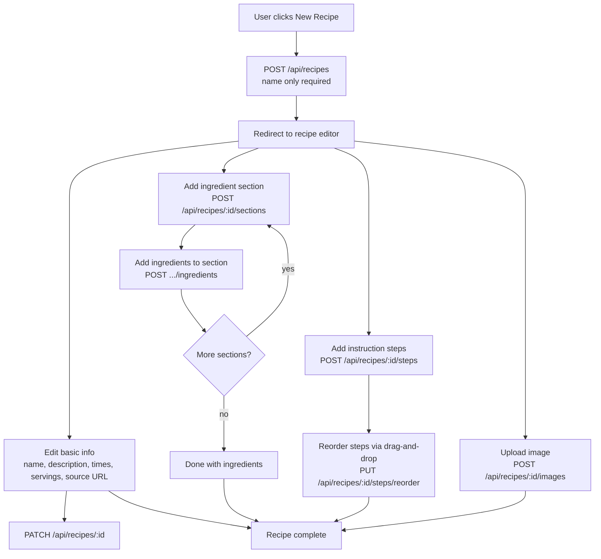
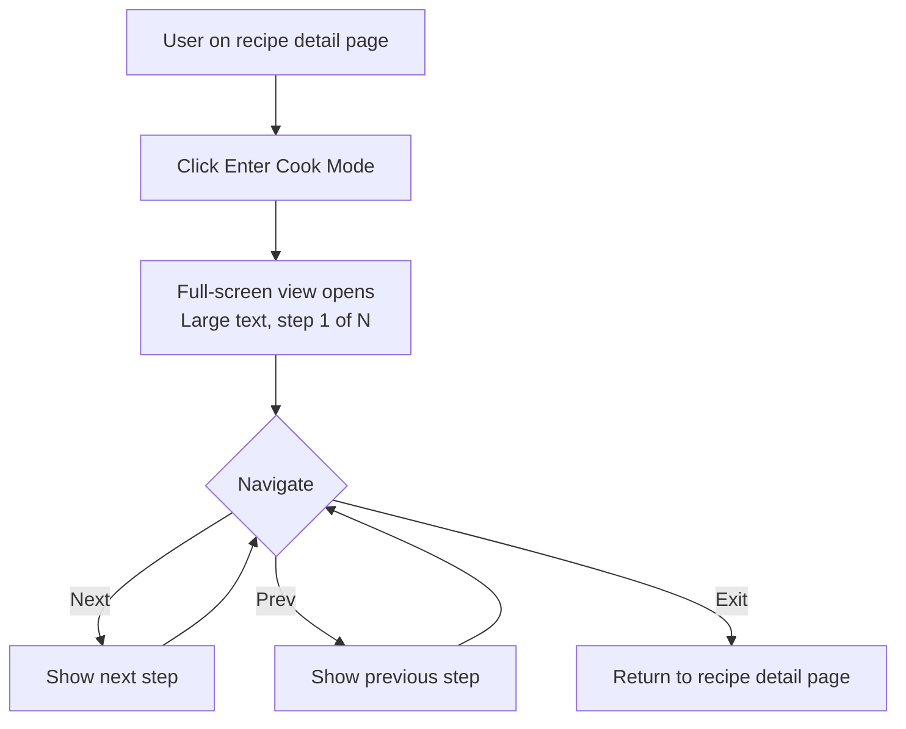
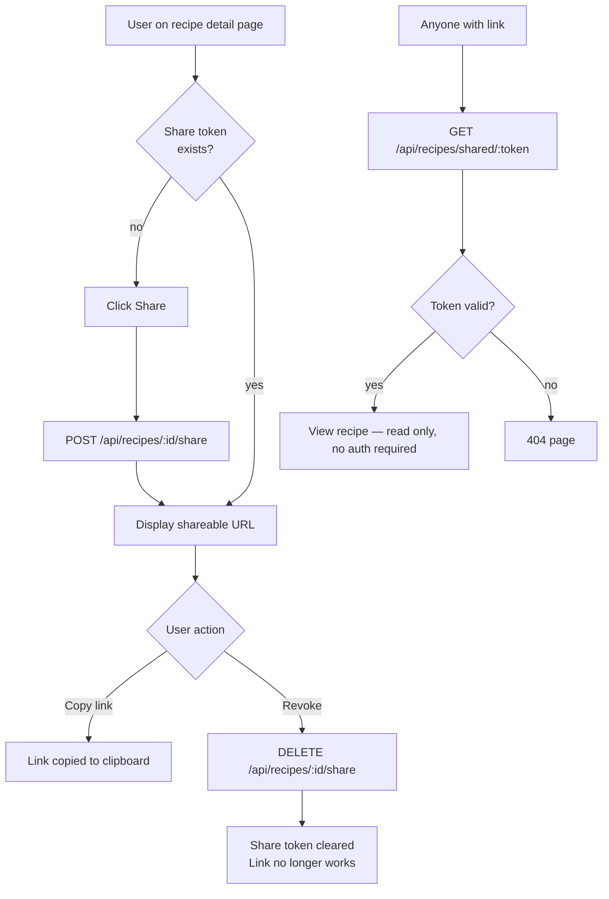
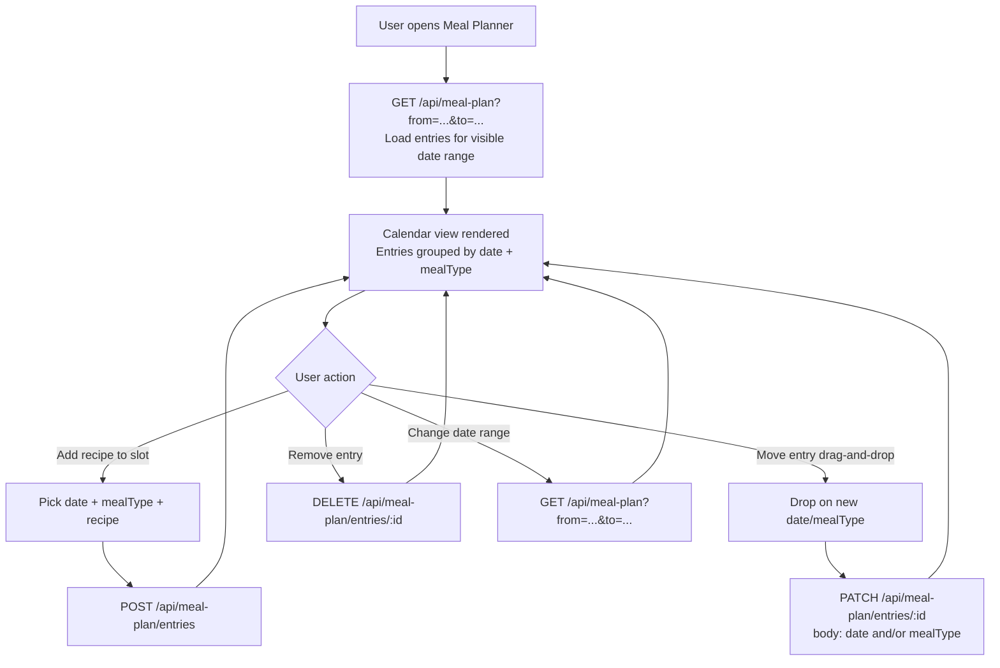
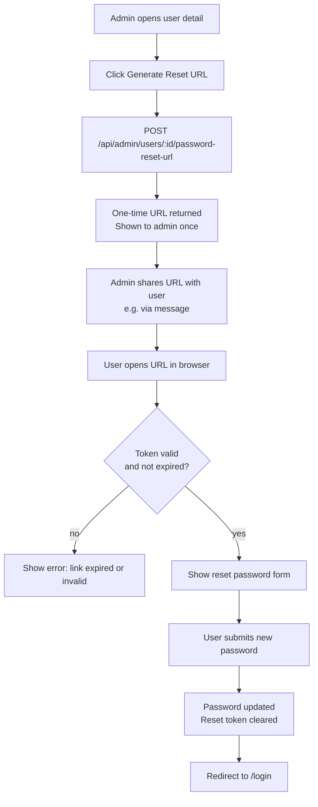
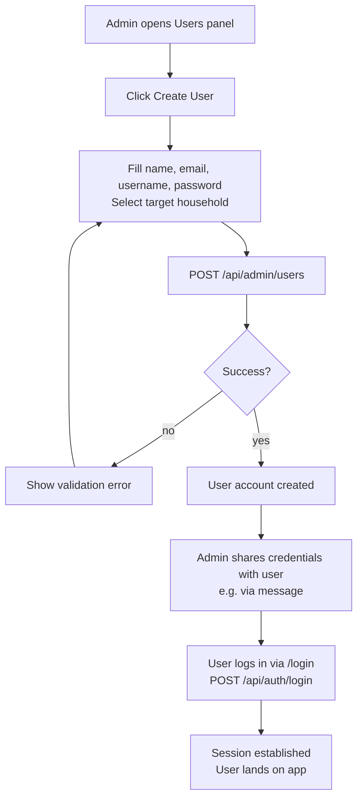
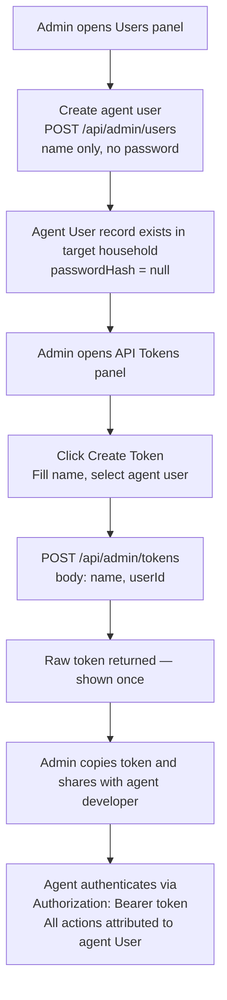
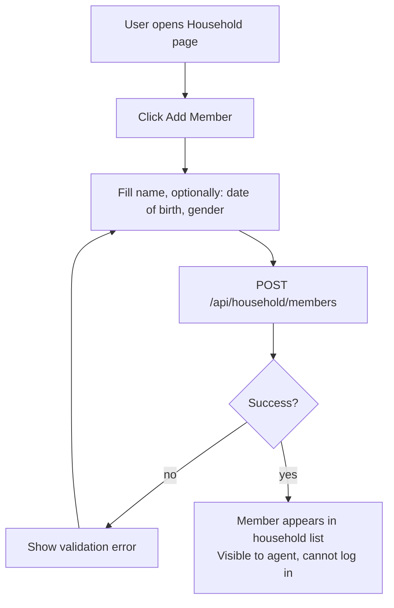

# Step 4 — User Flows

Key multi-step and branching flows. Straightforward CRUD (edit profile, delete recipe, etc.) is omitted — those are single-screen interactions fully covered by the API contract.

---

## 1. First-Time Setup

Runs once on fresh install. The UI checks `/api/setup` on boot and redirects accordingly.

---

## 2. User Login

---

## 3. Creating a Recipe

Recipe creation is incremental — the record is created first, then content is added in subsequent steps.

---

## 4. Cook Mode

Entered from the recipe detail page. Client-side only — no API calls during cook mode.

---

## 5. Recipe Sharing

---

## 6. Meal Planning

---

## 7. Password Reset

Admin-initiated. No email infrastructure — the URL is shared out-of-band.

---

## 8. Adding a User to a Household (with login)

Admin-initiated. The admin creates the account and shares credentials out-of-band.

---

## 9. Creating an API Key for an Agent User

Two-stage admin flow: first create the agent as a household member (no-login user), then issue a token tied to that user.

---

## 11. Adding a Household Member (no-login)

